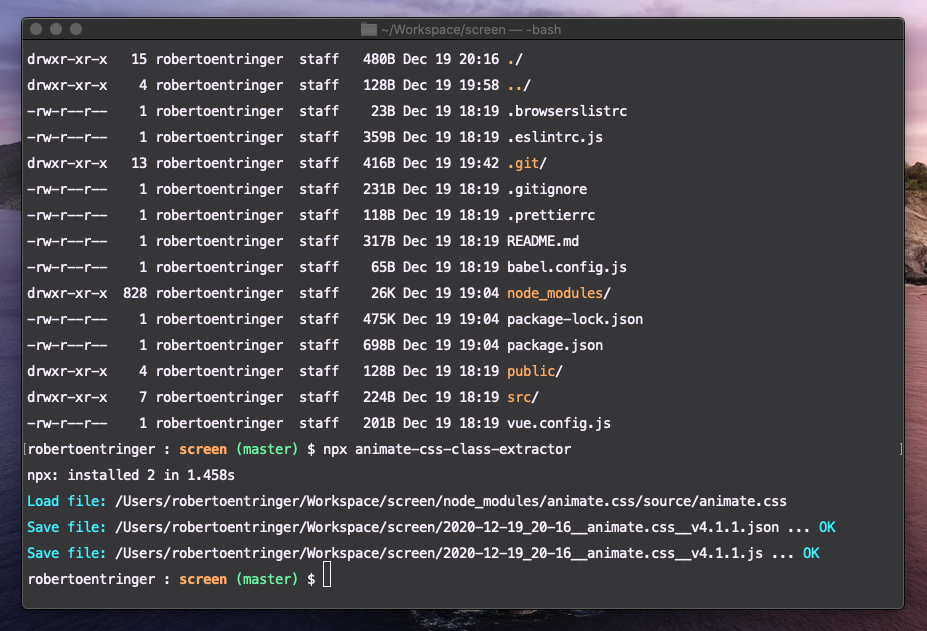

# Animate.css class extractor

The command tries first to extract the css classes from the animate.css available in your **_current project / work folder_**.

In the case animate.css is not available from the current project folder use the animate.css provided by the command itself as depencie.

Npm package : https://www.npmjs.com/package/animate-css-class-extractor

## Usage

```shell
$ npx animate-css-class-extractor

Parse file: .../node_modules/animate.css/source/animate.css
Save JSON file: .../2020-12-19_22-34__animate.css__v4.1.1.json ... OK
Save JS file: .../2020-12-19_22-34__animate.css__v4.1.1.js ... OK

```

## Module

```js
const { extractCssClasses } = require('animate-css-class-extractor')

const animations = extractCssClasses()

//-> animations
{
  'Attention seekers': [
    'bounce',    'flash',
    'pulse',     'rubberBand',
    'shakeX',    'shakeY',
    'headShake', 'swing',
    'tada',      'wobble',
    'jello',     'heartBeat'
  ],
  'Back entrances': [ 'backInDown', 'backInLeft', 'backInRight', 'backInUp' ],
  'Back exits': [ 'backOutDown', 'backOutLeft', 'backOutRight', 'backOutUp' ],
  'Bouncing entrances': [
    'bounceIn',
    'bounceInDown',
    'bounceInLeft',
    'bounceInRight',
    'bounceInUp'
  ],
  'Bouncing exits': [
    'bounceOut',
    'bounceOutDown',
    'bounceOutLeft',
    'bounceOutRight',
    'bounceOutUp'
  ],
  'Fading entrances': [
    'fadeIn',
    'fadeInDown',
    'fadeInDownBig',
    'fadeInLeft',
    'fadeInLeftBig',
    'fadeInRight',
    'fadeInRightBig',
    'fadeInUp',
    'fadeInUpBig',
    'fadeInTopLeft',
    'fadeInTopRight',
    'fadeInBottomLeft',
    'fadeInBottomRight'
  ],
  'Fading exits': [
    'fadeOut',
    'fadeOutDown',
    'fadeOutDownBig',
    'fadeOutLeft',
    'fadeOutLeftBig',
    'fadeOutRight',
    'fadeOutRightBig',
    'fadeOutUp',
    'fadeOutUpBig',
    'fadeOutTopLeft',
    'fadeOutTopRight',
    'fadeOutBottomRight',
    'fadeOutBottomLeft'
  ],
  Flippers: [ 'flip', 'flipInX', 'flipInY', 'flipOutX', 'flipOutY' ],
  Lightspeed: [
    'lightSpeedInRight',
    'lightSpeedInLeft',
    'lightSpeedOutRight',
    'lightSpeedOutLeft'
  ],
  'Rotating entrances': [
    'rotateIn',
    'rotateInDownLeft',
    'rotateInDownRight',
    'rotateInUpLeft',
    'rotateInUpRight'
  ],
  'Rotating exits': [
    'rotateOut',
    'rotateOutDownLeft',
    'rotateOutDownRight',
    'rotateOutUpLeft',
    'rotateOutUpRight'
  ],
  Specials: [ 'hinge', 'jackInTheBox', 'rollIn', 'rollOut' ],
  'Zooming entrances': [ 'zoomIn', 'zoomInDown', 'zoomInLeft', 'zoomInRight', 'zoomInUp' ],
  'Zooming exits': [
    'zoomOut',
    'zoomOutDown',
    'zoomOutLeft',
    'zoomOutRight',
    'zoomOutUp'
  ],
  'Sliding entrances': [ 'slideInDown', 'slideInLeft', 'slideInRight', 'slideInUp' ],
  'Sliding exits': [ 'slideOutDown', 'slideOutLeft', 'slideOutRight', 'slideOutUp' ]
}
```

## Screenshot

[](https://www.npmjs.com/package/animate-css-class-extractor)

# Resources

Animate.css by Daniel Eden
http://daneden.github.io/animate.css
